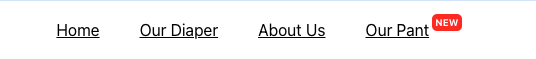

# A/B Testing Interview Assessment

## Context

You are designing a system to bucket users into two testing categories, v0 and v1, based on their UTM parameters. Your goal is to ensure that users are properly bucketed and see the correct number of menu items depending on their bucket.

## Requirements:

### Bucket Assignment Rules:

- Users who visit the site with `utm_source=google` parameters should be randomly assigned to either v0 or v1 with equal probability (50% chance for each).

- Otherwise users should be assigned to v0

### A/B Test purpose:

- Users in variant v0 get the current version as is.

- Users in variant v1 get an additional menu item to promote our new Pant product. The name of the menu item is “Our Pant“. Additionally, add a badge element with the word “NEW” to the new menu item.

### Implementation:

- Step 1: Add the `Our Pant` menu item to the nav bar. Add the badge, and make sure it's aligned.
Example: 

- Step 2: Get the `utm_source` paramter from URL. Assign the A/B test variant to the user based on the rules described above, and store it in localStorage.

- Step 3: Update the new menu item's visibility based on the assigned variant.

### Notes:

- You should implement a system to randomly assign users into v0 or v1 based on the UTM parameters as described. This value should be stored in localStorage.

- There are no restrictions on how you implement styling.

- Testing is encouraged. You can write any tests you want to validate the bucket assignment logic or UI behavior.

## Example Cases

- **Case 1:** UTM source equals ‘google’ \
UTM Parameter: ?utm_source=google \
Expected Behavior: Randomly assign the user to v0 or v1 with a 50% chance for each.

- **Case 2:** UTM source does not equal google’ \
UTM Parameter: ?utm_source=something_else \
Expected Behavior: User should be assigned to v0.

- **Case 3:** No UTM paramter \
Expected Behavior: User should be assigned to v0.
